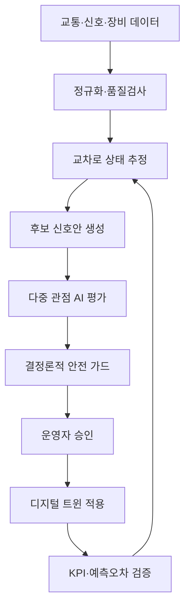

# 기술 구조

## 1. 전체 흐름



## 2. 계층별 책임

### 데이터 어댑터

입력 형식이 다른 센서·제어기·시뮬레이터 데이터를 공통 스키마로 변환한다.

예시 공통 이벤트:

```json
{
  "intersection_id": "SJ-DEMO-03",
  "timestamp": "2026-07-27T08:15:00+09:00",
  "lane_group": "south_through",
  "flow_vph": 780,
  "speed_kph": 18.4,
  "queue_m": 126,
  "signal_phase": "P2",
  "source_health": "degraded"
}
```

### 데이터 품질 계층

- 타임스탬프 지연
- 결측률
- 센서 간 불일치
- 비현실적 값
- 통신·장비 상태

데이터 품질이 임계치보다 낮으면 시스템은 자동 적용을 차단하고 “관찰 전용”으로 전환한다.

### 상태 추정

교차로별 상태를 정상, 혼잡, 과포화, 사고 의심, 장비 이상 등으로 분류한다. 인접 교차로의 대기행렬 전파도 함께 계산한다.

### 후보안 생성

MVP에서는 강화학습보다 설명 가능한 탐색 방식을 우선한다.

- 기준 TOD 유지
- 녹색시간 분할 조정
- 인접 교차로 오프셋 조정
- 긴급차량 우선안
- 보행 우선안

후보안은 허용된 파라미터 범위 안에서만 생성한다.

### 다중 관점 AI

LLM은 수치 최적화를 직접 책임지지 않는다.

- 구조화된 KPI를 읽고 운영 의미를 설명한다.
- 후보안의 장단점과 숨은 위험을 검토한다.
- 운영자에게 질문과 요약을 제공한다.
- 입력·출력은 JSON Schema로 제한한다.

### 결정론적 안전 가드

AI 평가와 독립적으로 실행한다.

```text
if conflicting_phase:
    reject
if pedestrian_minimum_not_met:
    reject
if stale_data or controller_unhealthy:
    shadow_mode_only
if change_rate_exceeds_limit:
    require_supervisor_review
```

### 승인·감사

모든 상태 전이는 이벤트로 남긴다.

```text
DRAFT → AI_REVIEWED → SAFETY_PASSED → HUMAN_APPROVED
      → SIMULATED → APPLIED_SHADOW → MEASURED
```

승인자, 입력 데이터 버전, 모델 버전, 규칙 버전, 후보안, 예상효과, 결과를 함께 저장한다.

## 3. MVP 권장 기술 스택

| 영역 | 권장안 |
|---|---|
| 프론트엔드 | Next.js 또는 React, TypeScript |
| 시각화 | MapLibre/Leaflet 또는 SVG 교차로 뷰, Recharts/ECharts |
| 백엔드 | FastAPI 또는 NestJS |
| 실시간 이벤트 | WebSocket 또는 Server-Sent Events |
| 시뮬레이션 | SUMO 연동 또는 단순 큐 기반 자체 시뮬레이터 |
| 최적화 | OR-Tools 또는 제한된 조합 탐색 |
| AI 설명 | 구조화 출력이 가능한 LLM API |
| 저장 | SQLite/PostgreSQL |
| 테스트 | 안전 규칙 단위 테스트, 시나리오 스냅샷 테스트 |

팀 숙련도와 해커톤 시간에 따라 SUMO가 부담되면 단순 큐 모델을 먼저 완성한다.

## 4. 데이터 모델

### Intersection

- id, name, location
- approaches, lanes, phases
- controller_type, protocol
- health_status

### Observation

- timestamp
- flow, occupancy, speed, queue
- signal_state
- source, quality_score

### SignalPlan

- cycle_length
- phase_splits
- offsets
- valid_window
- fallback_plan_id

### Proposal

- scenario_id
- candidate_plan
- predicted_kpis
- agent_reviews
- safety_result
- confidence

### Decision

- proposal_id
- actor
- action
- reason
- timestamp

### Evaluation

- baseline_kpis
- observed_kpis
- prediction_error
- constraint_violations

## 5. 고장과 복구

| 실패 | 동작 |
|---|---|
| 센서 결측 | 대체 데이터 사용 또는 섀도 모드 |
| 통신 지연 | 데이터 신선도 경고, 적용 차단 |
| 모델 응답 실패 | 기준 TOD 유지 |
| 안전 가드 실패 | 모든 후보안 거절 |
| 운영자 미승인 | 적용하지 않음 |
| 시뮬레이터 오류 | 결과 무효 처리 |
| 효과 악화 | 자동 롤백 후보 제시 |

## 6. 실제 도입으로 확장하는 단계

1. 공개·시뮬레이션 데이터로 MVP
2. 읽기 전용 실데이터 연동
3. 추천만 생성하는 섀도 모드
4. 운영자 승인형 제한 구간 실증
5. 표준 제어기 어댑터와 장애복구 검증
6. 관계기관 안전 검토 후 제한적 자동제어

## 7. 기술적 감동의 포인트

- 교차로 하나가 아니라 정체 전파를 본다.
- AI가 가장 공격적인 안을 내더라도 안전 규칙이 거부한다.
- 장비가 낡거나 데이터가 오래되면 똑똑한 척하지 않고 멈춘다.
- 운영자의 한 번의 승인과 그 근거가 모두 기록된다.
- 적용 후 예측이 틀렸는지까지 스스로 평가한다.
